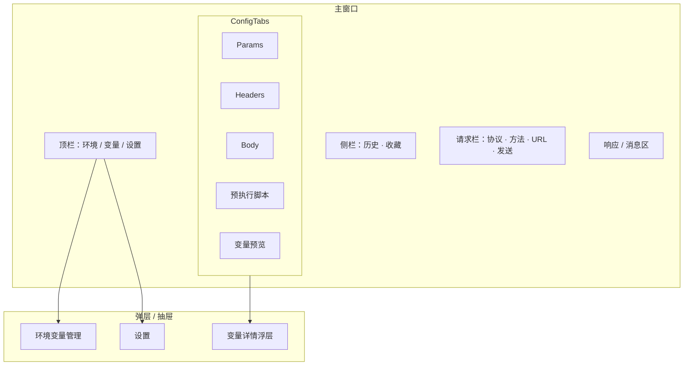
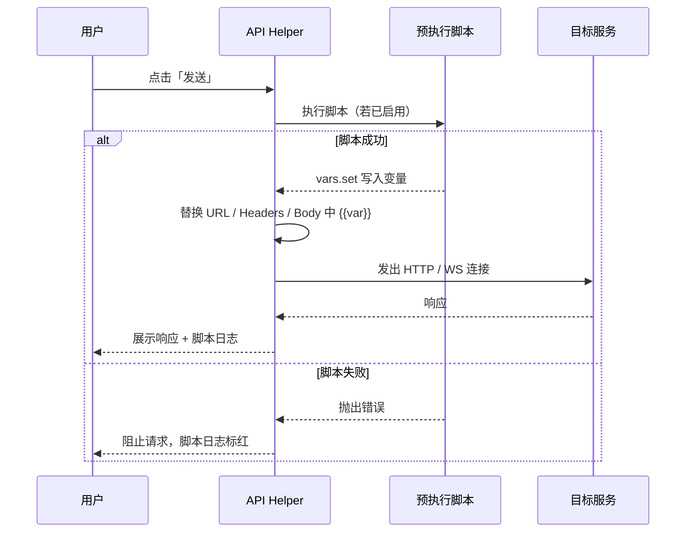

# API Helper — UI 线框图（Wireframe）

> 版本：v1.0  
> 日期：2026-06-11  
> 平台：**Windows 桌面单机版**（无 Web 版、无云端）  
> 窗口基准：**1280 × 800**（最小 1024 × 640，支持最大化）

---

## 1. 信息架构



---

## 2. 全局布局

### 2.1 主窗口（HTTP 模式 · 默认态）

```
┌─ API Helper ──────────────────────────────────────────────── □ ─ ✕ ─┐
│ ┌─────────────────────────────────────────────────────────────────┐ │
│ │ ⚡ API Helper    环境 [ 开发 ▼ ]   [变量 3]   [历史]   [⚙ 设置] │ │  ← 顶栏 48px
│ └─────────────────────────────────────────────────────────────────┘ │
│ ┌──────────┬──────────────────────────────────────────────────────┤
│ │ 历史     │  [ HTTP ▼ ] [ GET ▼ ]  https://api.example.com/users   │
│ │ ──────── │  ────────────────────────────────────────────────────  │
│ │ 🔍 搜索  │                                    [ ▶ 运行脚本 ] [ 发送 ] │  ← 请求栏 52px
│ │          │  ────────────────────────────────────────────────────  │
│ │ GET  /u… │  Params │ Headers │ Body │ 预执行脚本 │ 变量预览        │  ← Tab 40px
│ │ 10:32    │  ┌──────────────────────────────────────────────────┐  │
│ │ 200      │  │                                                  │  │
│ │          │  │              配置内容区（可滚动）                 │  │
│ │ POST /l… │  │                                                  │  │
│ │ 10:28    │  │                                                  │  │
│ │ 401      │  │                                                  │  │
│ │          │  └──────────────────────────────────────────────────┘  │
│ │ ──────── │  ═══════════════════ 可拖拽分割条 ═══════════════════  │
│ │ ★ 收藏   │  Response   ● 200 OK   128 ms   1.2 KB                │  ← 响应头 36px
│ │          │  Body │ Headers │ 脚本日志                              │
│ │ 登录接口 │  ┌──────────────────────────────────────────────────┐  │
│ │          │  │  {                                               │  │
│ │          │  │    "code": 0,                                    │  │
│ │          │  │    "data": { ... }                               │  │
│ │          │  │  }                                               │  │
│ │          │  └──────────────────────────────────────────────────┘  │
│ └──────────┴──────────────────────────────────────────────────────┘
│  Ctrl+Enter 发送 · 脚本已启用 · 本地数据 %AppData%\API Helper        │  ← 状态栏 24px
└─────────────────────────────────────────────────────────────────────┘

侧栏默认宽 220px，可拖拽收窄至 0（折叠为图标按钮）
请求区 : 响应区 默认高度比 ≈ 45% : 55%
```

### 2.2 顶栏组件说明

| 元素 | 行为 |
|------|------|
| 环境下拉 | 切换「开发 / 测试 / 生产」；右侧 `…` 打开环境变量抽屉 |
| `[变量 3]` | 点击展开「变量预览」Tab；数字 = 当前可用变量数（环境 + 脚本生成） |
| 历史 | 折叠/展开左侧栏 |
| 设置 | 打开设置窗口（主题、数据目录、超时、脚本超时） |

---

## 3. 请求栏

### 3.1 HTTP 请求栏

```
┌────────────────────────────────────────────────────────────────────┐
│ [ HTTP ▼ ] [ GET ▼ ] │ https://{{baseUrl}}/api/user?id=1          │
│                        │────────────────────────────────────────────│
│                        │  占位提示：输入 URL，支持 {{变量}}          │
└────────────────────────────────────────────────────────────────────┘
                                              [ ▶ 运行脚本 ]  [ 发送 ]
```

| 控件 | 说明 |
|------|------|
| 协议下拉 | `HTTP` / `WebSocket` |
| 方法下拉 | HTTP 时：`GET` / `POST`；WS 时隐藏 |
| URL 输入 | 单行；粘贴完整 URL 后自动解析 Params |
| 运行脚本 | 仅执行预执行脚本，不发请求；结果写入「脚本日志」 |
| 发送 | 流程：**脚本 → 变量替换 → 发请求**；进行中显示「取消」 |

### 3.2 WebSocket 请求栏

```
┌────────────────────────────────────────────────────────────────────┐
│ [ WebSocket ▼ ] │ wss://{{wsHost}}/socket                           │
└────────────────────────────────────────────────────────────────────┘
                         ● 未连接                    [ ▶ 运行脚本 ] [ 连接 ]
```

连接后按钮变为 `[ 断开 ]`，左侧状态：● 已连接（绿）/ 连接中（黄）/ 错误（红）

---

## 4. 配置 Tab 区

### 4.1 Params（Query 参数）

```
Params │ Headers │ Body │ 预执行脚本 │ 变量预览
──────────────────────────────────────────────
  ☑   Key              Value                    说明
 ─────────────────────────────────────────────────
  ☑   id               1
  ☑   page             {{page}}
  ☐   debug            true                     ← 禁用行不参与请求
 ─────────────────────────────────────────────────
 [ + 添加参数 ]              [ 从 URL 同步 ] [ 清空 ]
```

### 4.2 Headers（支持脚本变量引用）

```
Params │ Headers │ Body │ 预执行脚本 │ 变量预览
──────────────────────────────────────────────
  ☑   Header           Value
 ─────────────────────────────────────────────────
  ☑   Authorization    Bearer {{accessToken}}     ← 脚本生成
  ☑   X-Timestamp      {{timestamp}}
  ☑   Content-Type     application/json
 ─────────────────────────────────────────────────
 [ + 添加 Header ]    常用 ▼ [ Authorization ] [ Content-Type ] …

💡 值中使用 {{变量名}} 引用环境变量或预执行脚本输出
   悬停 {{accessToken}} 显示来源：预执行脚本 · 本请求
```

**变量引用交互：**

- 输入 `{{` 时弹出自动完成列表（环境变量 + 上次脚本输出）
- 发送前若变量未定义，Inline 警告：`⚠ accessToken 未定义，请先配置脚本或环境变量`
- 敏感 Header 展示时可点击 👁 切换掩码

### 4.3 Body（仅 POST）

```
Params │ Headers │ Body │ 预执行脚本 │ 变量预览
──────────────────────────────────────────────
 Body 类型：  ( • JSON )  ( Form )  ( Raw )  ( none )

 ┌─ JSON ──────────────────────────────────────────────── [ 格式化 ] ┐
 │ {                                                                   │
 │   "username": "{{username}}",                                       │
 │   "sign": "{{sign}}"                                                │
 │ }                                                                   │
 └─────────────────────────────────────────────────────────────────────┘
 ✓ JSON 合法                                    行 3 · 列 12 · UTF-8
```

---

## 5. 预执行脚本（核心新增）

### 5.1 脚本编辑 Tab

```
Params │ Headers │ Body │ 预执行脚本 │ 变量预览
──────────────────────────────────────────────
 ☑ 发送前执行此脚本          [ 插入模板 ▼ ] [ 查看 API 文档 ]

 ┌─ JavaScript ──────────────────────────────────────────────────────┐
 │ 1 │ // 生成 timestamp 与 sign，供 Headers / Body 引用               │
 │ 2 │ const ts = Date.now().toString();                               │
 │ 3 │ vars.set('timestamp', ts);                                      │
 │ 4 │                                                                 │
 │ 5 │ const secret = env.get('apiSecret');                            │
 │ 6 │ const sign = crypto.md5(ts + secret);                           │
 │ 7 │ vars.set('sign', sign);                                         │
 │ 8 │                                                                 │
 │ 9 │ // 可选：动态 token                                             │
 │10 │ vars.set('accessToken', await auth.fetchToken());               │
 │11 │ console.log('sign generated:', sign);                           │
 └─────────────────────────────────────────────────────────────────────┘
                                              [ ▶ 运行脚本 ]  耗时 12ms ✓

 脚本 API（侧边可折叠 cheatsheet）：
 ┌──────────────────┬────────────────────────────────────────────┐
 │ vars.set(k, v)   │ 设置请求级变量，Headers/URL/Body 可 {{k}}  │
 │ vars.get(k)      │ 读取变量（含环境变量）                      │
 │ env.get(k)       │ 只读当前环境变量                            │
 │ crypto.md5/sha256│ 常用摘要                                    │
 │ console.log      │ 输出到响应区「脚本日志」                    │
 └──────────────────┴────────────────────────────────────────────┘
```

### 5.2 执行流程（发送时）



### 5.3 脚本日志（响应区子 Tab）

```
Response  ● 200 OK   128 ms          Body │ Headers │ 脚本日志
──────────────────────────────────────────────────────────────
 [10:32:01] 预执行脚本开始
 [10:32:01] sign generated: a3f8c2...
 [10:32:01] 变量已更新: timestamp, sign, accessToken
 [10:32:01] 预执行脚本完成 (12ms)

── 若仅「运行脚本」未发请求 ──
 [10:30:00] 预执行脚本完成 (8ms)
 [10:30:00] ✓ 生成变量: timestamp=1718083800123, sign=a3f8c2...
```

脚本失败示例：

```
 [10:32:01] ✗ 脚本错误 第 6 行: apiSecret 未定义
             建议：在环境变量中添加 apiSecret，或改用 env.get 默认值

 [ 跳转到脚本 ]  [ 打开环境变量 ]
```

---

## 6. 变量预览 Tab

展示**发送前**即将使用的全部变量（环境 + 脚本输出），便于调试。

```
Params │ Headers │ Body │ 预执行脚本 │ 变量预览
──────────────────────────────────────────────
 [ ▶ 运行脚本刷新 ]                              共 5 个变量

 变量名          值（发送时将替换为）       来源          引用位置
 ─────────────────────────────────────────────────────────────────
 baseUrl         https://dev.api.com        环境·开发      URL
 accessToken     eyJhbGci...（掩码）        预执行脚本     Header
 timestamp       1718083800123              预执行脚本     Header
 sign            a3f8c2d1e9...              预执行脚本     Body
 page            1                          Params         Query

 💡 点击行可在 Headers / Body 中定位 {{变量名}} 的使用位置
```

---

## 7. WebSocket 模式 — 完整布局

```
┌─ API Helper ──────────────────────────────────────────────── □ ─ ✕ ─┐
│  环境 [ 开发 ▼ ]                              [变量 2]  [⚙ 设置]  │
├──────────┬──────────────────────────────────────────────────────────┤
│  历史    │ [ WebSocket ▼ ]  wss://echo.example.com/ws               │
│          │                              ● 已连接    [运行脚本][断开] │
│          │  Headers │ 预执行脚本 │ 变量预览                          │
│          │  ┌────────────────────────────────────────────────────┐  │
│          │  │ Authorization    Bearer {{accessToken}}            │  │
│          │  └────────────────────────────────────────────────────┘  │
│          │  ═════════════════════════════════════════════════════  │
│          │  消息                                    [ 清空 ] [ 导出 ]│
│          │  ┌────────────────────────────────────────────────────┐  │
│          │  │ 10:35:01 ↓  {"type":"welcome"}                     │  │
│          │  │ 10:35:05 ↑  {"type":"ping"}                        │  │
│          │  │ 10:35:05 ↓  {"type":"pong"}                        │  │
│          │  └────────────────────────────────────────────────────┘  │
│          │  ┌────────────────────────────────────────────────────┐  │
│          │  │ {"type":"ping"}                          [ 发送 ]  │  │
│          │  └────────────────────────────────────────────────────┘  │
└──────────┴──────────────────────────────────────────────────────────┘
```

连接前同样走：**预执行脚本 → 替换 Headers / URL 变量 → 建立 WS**

---

## 8. 侧栏 — 历史与收藏

### 8.1 历史列表

```
┌─ 历史 ──────────────┐
│ 🔍 搜索请求…        │
│ [ 全部 │ 收藏 ]     │
│─────────────────────│
│ GET  /api/users     │
│      200 · 10:32    │
│─────────────────────│
│ POST /api/login  ★  │
│      401 · 10:28    │
│─────────────────────│
│ WS   wss://…        │
│      已连接 · 10:20 │
│─────────────────────│
│                     │
│ [ 清空历史 ]        │
└─────────────────────┘
```

右键菜单：`复用` · `收藏/取消` · `复制 URL` · `删除`

### 8.2 复用行为

点击历史项 → 恢复 URL、Params、Headers、Body、**预执行脚本**、启用开关

---

## 9. 环境变量抽屉（从顶栏打开）

```
                    ┌─ 环境变量 ───────────────────── ✕ ─┐
                    │ 环境: [ 开发 ▼ ] [+ 新建] [ 导入 ] [ 导出 ] │
                    │─────────────────────────────────────────────│
                    │  Key              Value                     │
                    │  baseUrl          https://dev.api.com       │
                    │  apiSecret        ****************  👁      │
                    │  username         admin                     │
                    │─────────────────────────────────────────────│
                    │  [ + 添加变量 ]                             │
                    │                                             │
                    │  💡 环境变量可被脚本 env.get() 读取          │
                    │     也可直接在 Headers 中用 {{key}} 引用    │
                    │                              [ 保存 ]       │
                    └─────────────────────────────────────────────┘
                                                              宽 480px
                                                              右侧滑入
```

---

## 10. 设置窗口

```
┌─ 设置 ────────────────────────────────────────────── ✕ ─┐
│  [ 通用 ] [ 请求 ] [ 脚本 ] [ 数据 ]                     │
│──────────────────────────────────────────────────────────│
│  通用                                                    │
│    主题        ( • 跟随系统 ) ( 浅色 ) ( 深色 )         │
│    字体大小    [ 13px ▼ ]                               │
│                                                          │
│  请求                                                    │
│    HTTP 超时   [ 30 ] 秒                                 │
│    跟随重定向  [✓]                                       │
│                                                          │
│  脚本                                                    │
│    脚本超时    [ 5 ] 秒                                  │
│    失败时      ( • 阻止请求 ) ( 仍继续发送 )             │
│                                                          │
│  数据（单机本地）                                        │
│    存储位置    C:\Users\...\AppData\Roaming\API Helper   │
│                [ 打开目录 ] [ 更改… ]                    │
│    历史保留    [ 100 ] 条                                │
│    [✓] 敏感 Header 写入历史时掩码                        │
│                                                          │
│                                    [ 取消 ] [ 保存 ]     │
└──────────────────────────────────────────────────────────┘
```

---

## 11. 空状态与错误态

### 11.1 首次打开

```
┌────────────────────────────────────────────────────────────┐
│                                                            │
│              ⚡ 发送第一个请求                              │
│                                                            │
│     输入 URL，点击发送。需要签名 / Token？                  │
│     打开「预执行脚本」Tab 生成变量，在 Header 里用          │
│     {{变量名}} 引用。                                       │
│                                                            │
│              [ 查看示例：带签名的 GET ]                     │
│                                                            │
└────────────────────────────────────────────────────────────┘
```

### 11.2 响应区空态

```
 Response
 ─────────────────────────────────────────
        尚未发送请求
        Ctrl + Enter 快速发送
```

### 11.3 网络错误

```
 Response   ✗ 网络错误   3021 ms
 ─────────────────────────────────────────
 无法连接到服务器

 可能原因：
 · 目标地址不可达
 · DNS 解析失败
 · 连接超时（当前 30s）

 [ 重试 ]   [ 复制错误详情 ]
```

---

## 12. 组件尺寸与间距规范

|  token   | 值 | 用途 |
|----------|----|------|
| 顶栏高度 | 48px | Logo、环境、全局操作 |
| 请求栏 | 52px | URL + 主按钮 |
| Tab 栏 | 40px | Params / Headers / … |
| 侧栏宽 | 220px（可拖） | 历史列表 |
| 主按钮 | 高 36px，最小宽 80px | 发送 / 连接 |
| 次按钮 | 高 32px | 运行脚本、格式化 |
| 圆角 | 6px | 输入框、卡片 |
| 分割条 | 4px 热区 | 上下拖拽调整响应区高度 |

---

## 13. 色彩与状态（线框标注）

| 语义 | 浅色主题 | 用途 |
|------|----------|------|
| Primary | `#2563EB` | 发送、连接 |
| Success | `#16A34A` | 2xx、脚本成功 |
| Warning | `#D97706` | 4xx、变量缺失提示 |
| Error | `#DC2626` | 5xx、脚本错误、网络失败 |
| Muted | `#6B7280` | 次要文字、状态栏 |

---

## 14. 快捷键

| 快捷键 | 作用 |
|--------|------|
| `Ctrl + Enter` | 发送 / WS 发送消息 |
| `Ctrl + R` | 仅运行预执行脚本 |
| `Ctrl + L` | 聚焦 URL |
| `Ctrl + S` | 收藏当前请求 |
| `Ctrl + B` | 折叠/展开侧栏 |
| `Ctrl + 1~5` | 切换 Params / Headers / Body / 脚本 / 变量 |

---

## 15. 页面清单（开发用）

| # | 屏幕 | 优先级 |
|---|------|--------|
| W-01 | 主窗口 · HTTP GET | P0 |
| W-02 | 主窗口 · HTTP POST + Body | P0 |
| W-03 | 预执行脚本 Tab + 脚本日志 | P0 |
| W-04 | 变量预览 Tab | P0 |
| W-05 | Headers 变量引用 + 自动完成 | P0 |
| W-06 | WebSocket 消息流 | P0 |
| W-07 | 历史侧栏 + 收藏 | P0 |
| W-08 | 环境变量抽屉 | P1 |
| W-09 | 设置窗口 | P1 |
| W-10 | 空状态 / 错误态 | P1 |

---

## 16. 典型用例线框：签名 Header

**场景：** Header 需要 `X-Timestamp` + `X-Sign`，签名由脚本生成。

```
① 环境变量          ② 预执行脚本                    ③ Headers
   apiSecret=xxx       vars.set('timestamp', ts)       X-Timestamp: {{timestamp}}
                       vars.set('sign', md5(...))       X-Sign: {{sign}}

④ 点击发送 → 脚本运行 → 变量替换 → 实际请求头：
   X-Timestamp: 1718083800123
   X-Sign: a3f8c2d1e9b7...
```

---

**下一步：** 基于线框输出 [TDD 技术设计](TDD.md) 或直接进入 Tauri + React 项目脚手架。
